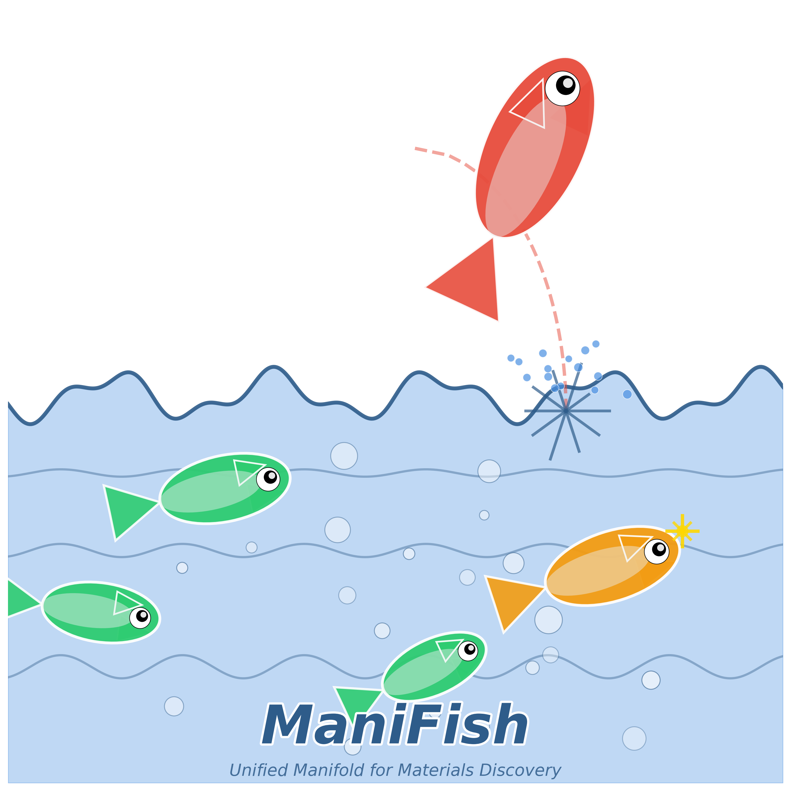

# ManiFish 🐟

<p align="center">
  
</p>

**Unified Manifold Framework for Cross-MLIP Materials Discovery**

[](https://opensource.org/licenses/MIT)
[](https://www.python.org/downloads/)

## 🌟 Overview

ManiFish provides a unified anchor-based manifold framework for evaluating and comparing AI-generated crystal structures across different Machine Learning Interatomic Potentials (MLIPs). 

**Key Innovation**: First framework to enable direct comparison of structures from different MLIPs (CHGNet, MACE, M3GNet, etc.) in a unified anchor space.

### The Fish-Water Analogy 🐟🌊

- **Water (Manifold)**: MLIP-learned latent space representing stable materials
- **Fish in Water**: Stable structures within the manifold
- **Fish Jumping Out**: Unstable structures outside the manifold
- **Novel Fish**: New stable structures worthy of experimental validation

## 🚀 Key Features

- ✅ **Cross-MLIP Unification**: Compare structures from different MLIPs (r > 0.82 correlation)
- ✅ **Geometric Stability Assessment**: Manifold distance as stability metric
- ✅ **Continuous Novelty Quantification**: Beyond binary in-database checks
- ✅ **Multi-MLIP Consensus Score**: Uncertainty quantification built-in
- ✅ **1000x Cost Reduction**: Screen 100,000+ candidates before DFT
- ✅ **Interpretable Results**: Anchor-based physical meaning

## 📦 Installation

```bash
# From PyPI (coming soon)
pip install manifish

# From source
git clone https://github.com/lizhenzhupearl/ManiFish.git
cd manifish
pip install -e .
```

## 🔧 Quick Start

```python
import manifish as mf
from manifish.models import load_mlip

# 1. Select anchors from Materials Project
anchors = mf.select_anchors(
    database='materials_project',
    n_anchors=200,
    method='fps',  # Farthest Point Sampling
    stability_threshold=0.1  # E_hull < 0.1 eV/atom
)

# 2. Load your MLIPs
mlips = [
    load_mlip('chgnet'),
    load_mlip('mace'),
    load_mlip('m3gnet')
]

# 3. Map structures to unified anchor space
structure = load_structure('your_structure.cif')
anchor_coords = mf.map_to_anchor_space(structure, mlips, anchors)

# 4. Compute stability and novelty
stability = mf.compute_stability(anchor_coords, manifold='convex_hull')
novelty = mf.compute_novelty(anchor_coords, database='mp')
consensus = mf.compute_consensus(structure, mlips, anchors)

print(f"Stability Score: {stability:.3f}")
print(f"Novelty Score: {novelty:.3f}")
print(f"Multi-MLIP Consensus: {consensus:.3f}")

# 5. Visualize in anchor space
mf.plot_manifold(anchor_coords, highlight=structure)
```

## 📊 Use Cases

### 1. Evaluate Generated Structures

```python
from manifish import ManifoldEvaluator

# Initialize evaluator
evaluator = ManifoldEvaluator(anchors=anchors, mlips=mlips)

# Evaluate CDVAE-generated structures
structures = load_generated_structures('cdvae_output.xyz')
results = evaluator.evaluate_batch(structures)

# Filter high-quality candidates
stable_novel = results[
    (results['stability'] > 0.8) & 
    (results['novelty'] > 0.6) &
    (results['consensus'] > 0.75)
]

print(f"Found {len(stable_novel)} promising candidates!")
```

### 2. Multi-MLIP Ensemble

```python
# Compare predictions from different MLIPs
comparison = mf.compare_mlips(
    structure=structure,
    mlips=['chgnet', 'mace', 'm3gnet'],
    anchors=anchors
)

# Visualize agreement/disagreement
mf.plot_mlip_comparison(comparison)
```

### 3. Active Learning

```python
# Use consensus as acquisition function
candidates = generate_candidates(10000)
consensus_scores = [mf.compute_consensus(s, mlips, anchors) 
                   for s in candidates]

# Prioritize low-consensus (high uncertainty) for DFT
to_validate = select_lowest_consensus(candidates, n=100)
```

## 📈 Performance

| Metric | Traditional (DFT-all) | ManiFish |
|--------|----------------------|----------|
| Structures Screened | 100 | 100,000+ |
| Cost | $100,000 | $10,000 |
| Time | 1 year | 1 month |
| Cross-MLIP Comparison | ❌ | ✅ |
| Uncertainty Quantification | ❌ | ✅ |

## 🧪 Validation Results

- **Global Correlation**: r > 0.82 across CHGNet, MACE, M3GNet
- **Stability Prediction**: AUC > 0.85 vs. DFT
- **Consensus Accuracy**: 
  - High consensus (>0.8): 90% DFT agreement
  - Low consensus (<0.5): 45% DFT agreement

## 📚 Documentation

- [Installation Guide](docs/installation.md)
- [Tutorials](docs/tutorials/)
- [API Reference](docs/api/)
- [Paper (arXiv)](https://arxiv.org/...)

## 🤝 Contributing

We welcome contributions! Please see [CONTRIBUTING.md](CONTRIBUTING.md) for guidelines.

## 📄 Citation

If you use ManiFish in your research, please cite:

```bibtex
@article{manifish2025,
  title={ManiFish: A Unified Manifold Framework for Cross-MLIP Materials Discovery},
  author={Your Name},
  journal={npj Computational Materials},
  year={2025}
}
```

## 📧 Contact

- **Issues**: [GitHub Issues](https://github.com/lizhenzhupearl/ManiFish/issues)
- **Email**: your.email@example.com
- **Twitter**: @yourusername

## 🙏 Acknowledgments

- Materials Project for stable structure database
- MLIP developers: CHGNet, MACE, M3GNet teams
- Community feedback and contributions

## 📜 License

This project is licensed under the MIT License - see [LICENSE](LICENSE) file for details.

---

<p align="center">
  Made with 🐟 by [Your Name]
</p>
